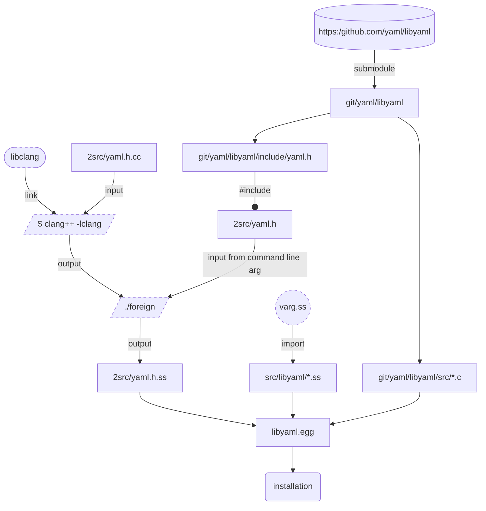

# libyaml.ss

## Overview

```mermaid
flowchart

yaml/libyaml[(https:/github.com/yaml/libyaml)]
--submodule--> git/yaml/libyaml --> git/yaml/libyaml/src/*.c

libclang([libclang])
--link--> clang++[/clang++ -lclang/]
style libclang stroke-dasharray: 5 5
2src/yaml.h.cc
--input--> clang++[/clang++ -lclang/]
style clang++ stroke-dasharray: 5 5
clang++[/$ clang++ -lclang/]
-- output --> foreign[/./foreign/]
style foreign stroke-dasharray: 5 5

git/yaml/libyaml
--> git/yaml/libyaml/include/yaml.h
--#include--o 2src/yaml.h
--input from command line arg-->foreign

foreign
-- output --> 2src/yaml.h.ss

2src/yaml.h.ss
--> libyaml.egg
style varg.ss stroke-dasharray: 5 5
varg.ss((varg.ss))
--import--> src/libyaml/*.ss
--> libyaml.egg
git/yaml/libyaml/src/*.c
--> libyaml.egg

END(installation)
libyaml.egg
--> END
```
