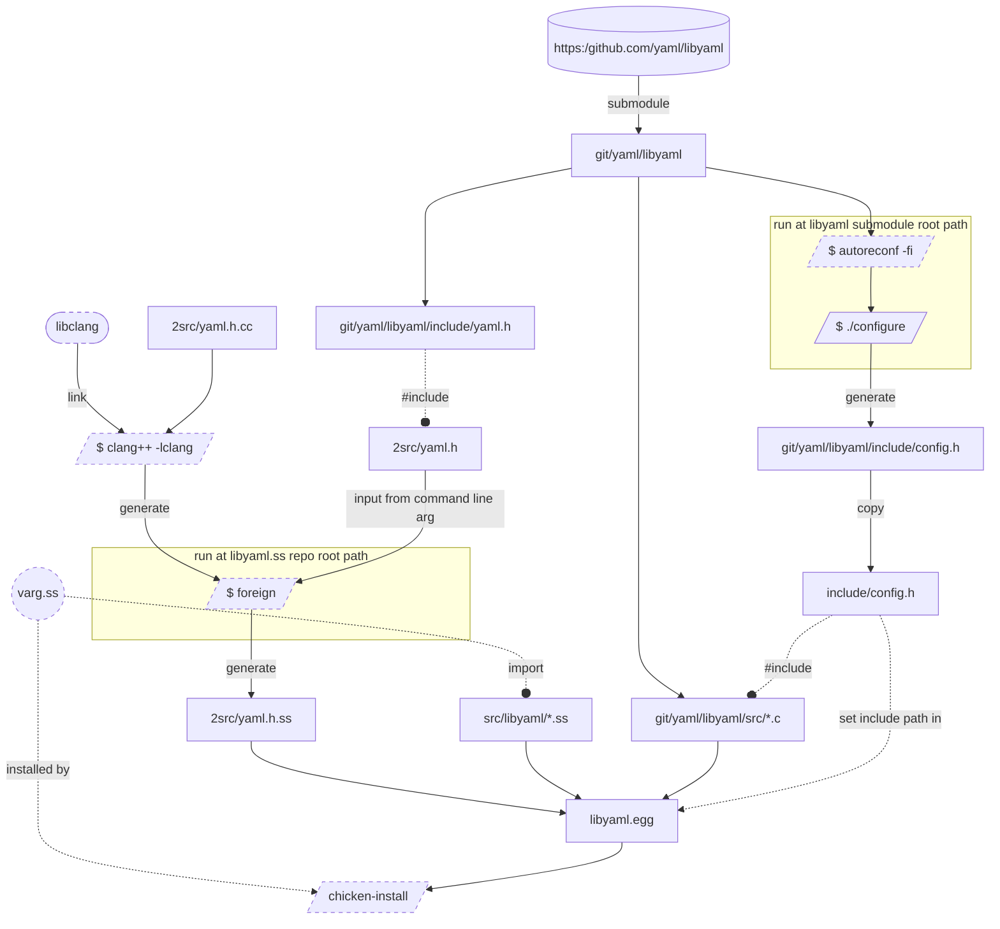

# libyaml.ss

## Overview

```mermaid
flowchart

yaml/libyaml[(https:/github.com/yaml/libyaml)]
--submodule--> git/yaml/libyaml --> git/yaml/libyaml/src/*.c

libclang([libclang])
--link--> clang++[/clang++ -lclang/]
style libclang stroke-dasharray: 5 5
2src/yaml.h.cc
--> clang++[/clang++ -lclang/]
style clang++ stroke-dasharray: 5 5
clang++[/$ clang++ -lclang/]
--generate --> foreign[/$ foreign/]
style foreign stroke-dasharray: 5 5

git/yaml/libyaml
--> git/yaml/libyaml/include/yaml.h
-. #include .-o 2src/yaml.h
--input from command line arg-->foreign

subgraph "run at libyaml.ss repo root path"
foreign
end

foreign
--generate--> 2src/yaml.h.ss

2src/yaml.h.ss
--> libyaml.egg
style varg.ss stroke-dasharray: 5 5
varg.ss((varg.ss))
-. import .-o src/libyaml/*.ss
--> libyaml.egg
varg.ss -. installed by .-> chicken-install

git/yaml/libyaml
--> autoreconf[/$ autoreconf -fi/]
style autoreconf stroke-dasharray: 5 5
subgraph "run at libyaml submodule root path"
autoreconf --> configure[/$ ./configure/]
end

configure
--generate--> git/yaml/libyaml/include/config.h
--copy--> include/config.h
-. #include .-o git/yaml/libyaml/src/*.c
--> libyaml.egg

include/config.h
-. set include path in .-> libyaml.egg 

libyaml.egg
--> chicken-install[/chicken-install/]
style chicken-install stroke-dasharray: 5 5
```
